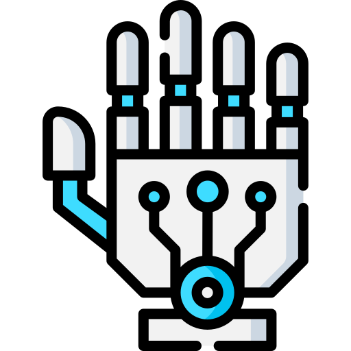
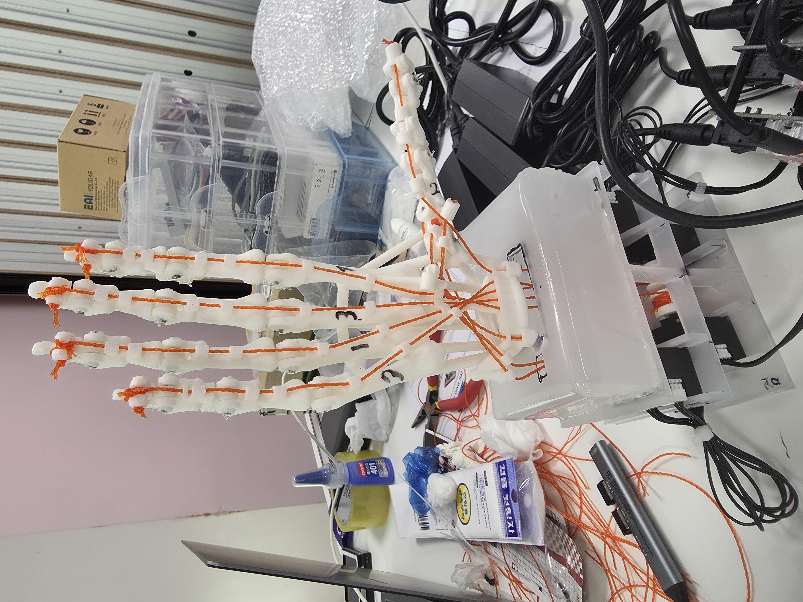

<p align="center">
  
</p>

<h1 align="center">THING</h1>

<p align="center">
  <strong>손동작을 인식해 7축 텐던 로봇 손으로 재현하는 Human-Mimetic Robot Hand</strong>
</p>

THING은 MediaPipe로 손의 21개 특징점(landmark)을 인식하고, 이를 네 손가락의
굽힘과 엄지의 굽힘·대립·벌림으로 구성된 7개 논리축 명령으로 변환합니다.
3D 프린팅 기구와 전자 설계부터 ROS 2 기반 비전·제어, DYNAMIXEL 구동,
React 관제 UI, 동작 기록과 데이터 포털까지 하나의 저장소에서 관리합니다.

> **프로젝트 상태**
>
> Jetson Orin Nano의 비전·기록 경로와 Raspberry Pi 5의 안전·모터 제어 경로를
> 통합했으며, 실물 텐던 로봇 손을 이용한 모방 제어와 파지 시연을 완료했습니다.
> 저장소는 SSAFY GitLab 프로젝트의 `main` 최신 스냅샷을 포트폴리오 형태로
> 정리한 버전입니다.

## 시연 영상

<p align="center">
  <a href="media/videos/최종시연.mp4">
    
  </a>
</p>

<p align="center">
  <sub>실물 텐던 로봇 손 · 이미지를 클릭하면 최종 통합 시연 영상을 볼 수 있습니다.</sub>
</p>

- [최종 통합 시연](media/videos/최종시연.mp4)
- [실시간 손동작 모방](media/videos/모방시연.mp4)
- [지연 개선 후 웨이브 모방](media/videos/모방웨이브지연개선.mp4)
- [캔 파지 모방](media/videos/모방캔파지.mp4)
- [유연한 물체 파지](media/videos/파지말랑이.mp4)

영상 파일은 Git LFS로 관리합니다.

## 핵심 구현

| 영역 | 구현 내용 |
| --- | --- |
| 기구·전자 | 3D 프린팅 텐던 로봇 손, CAD·STL·URDF, 7축 DYNAMIXEL 배선과 안전 전원 자료 |
| 비전 | USB 카메라 프레임, MediaPipe Hands 기반 21개 landmark 검출, 정규화된 7축 `HandCommand` 생성 |
| 제어·안전 | MIMIC·MANUAL·TELEOP 명령 중재, 명령 검증, 안전 상태 관리, XL330-M288-T 7축 구동 |
| 관제 UI | WebSocket·MJPEG 기반 실시간 상태 확인, 제어권 관리, 모방·수동 조작, 기록 판정 UI |
| 기록·데이터 | rosbag2 기록, JSON·CSV exporter, HTTPS uploader, EC2 세션 조회·다운로드 포털 |
| 운용 | Jetson·Raspberry Pi 배포 설정, ROS 2 통합 launch, Raspberry Pi 시연 자동화 스크립트 |

## 시스템 구성

```text
사용자 손
  → Camera / MediaPipe / 7축 목표 생성                (Jetson Orin Nano)
  → command_manager / command_guard / safety_manager (Raspberry Pi 5)
  → DYNAMIXEL XL330-M288-T × 7
  → 텐던 로봇 손

카메라·로봇 상태
  → Web Bridge (WebSocket + MJPEG)
  → React 관제·제어 웹                               (Laptop)

동작 데이터
  → rosbag2 → exporter → uploader                    (Jetson Orin Nano)
  → Django API / SQLite / 파일 저장                  (AWS EC2)
```

웹은 모터를 직접 제어하지 않습니다. 모든 일반 명령은 Raspberry Pi의 명령 중재와
안전 검증을 통과하며, 네트워크가 복구돼도 사용자의 명시적인 입력 전에는 자동으로
움직이지 않도록 구성했습니다.

## 빠르게 확인하기

### 저장소 받기

Git LFS가 필요합니다.

```bash
git lfs install
git clone https://github.com/SeMinKong/THING.git
cd THING
git lfs pull
```

### 로봇 없이 관제 UI 실행

```bash
cd web/frontend
npm ci
npm run mock
```

다른 터미널에서 다음 명령을 실행합니다.

```bash
cd web/frontend
npm run dev
```

### ROS 2 패키지 빌드

Ubuntu 22.04와 ROS 2 Humble 환경을 기준으로 합니다.

```bash
source /opt/ros/humble/setup.bash
cd thing_ws
rosdep install --from-paths src --ignore-src -r -y
colcon build --symlink-install
source install/setup.bash
colcon test
colcon test-result --verbose
```

실물 장비를 구동하기 전에는 장치별 설정과 안전 문서를 먼저 확인하세요.

## 저장소 구성

| 경로 | 내용 |
| --- | --- |
| [`mechanical/`](mechanical/) | CAD, STL, 도면과 조립 자료 |
| [`electronics/`](electronics/) | BOM, 회로, 배선과 안전 전원 자료 |
| [`thing_ws/`](thing_ws/) | ROS 2 인터페이스·비전·제어·하드웨어·로거·Web Bridge·bringup |
| [`web/frontend/`](web/frontend/) | 내부망 React 관제·제어 UI |
| [`deploy/`](deploy/) | Jetson·Raspberry Pi 배포 설정 |
| [`exec/`](exec/) | Raspberry Pi 시연 실행·종료 스크립트 |
| [`EC2/thing_database_web/`](EC2/thing_database_web/) | 실험 데이터 포털 프런트엔드·백엔드 |
| [`tests/`](tests/) | 자동화 테스트와 실물 시험 절차 |
| [`docs/`](docs/) | 요구사항, 아키텍처, 인터페이스, 환경 설정과 개발 기록 |
| [`media/`](media/) | 프로젝트 이미지와 시연 영상 |

## 주요 문서

- [시스템 아키텍처](docs/architecture.md)
- [ROS 2·Web·EC2 인터페이스](docs/interfaces.md)
- [요구사항 명세서](docs/requirements/요구사항%20명세서%20V6.3.md)
- [Ubuntu 개발 환경](docs/setup/ubuntu.md)
- [DYNAMIXEL 설정](docs/setup/dynamixel.md)
- [내부 관제 웹](web/README.md)
- [기구 자료](mechanical/README.md)
- [전자·배선 자료](electronics/README.md)
- [시험 절차](tests/README.md)
- [EC2 데이터 포털](EC2/README.md)

## 안전

실제 모터에 토크를 인가하기 전에 모터 ID, 이동 범위, 전류 제한, 텐던 장력과
비상 정지·전원 차단 수단을 확인해야 합니다.

- [DYNAMIXEL 도구와 기본 점검](tools/dynamixel/README.md)
- [모터 제어 안전 지침](docs/motor-control/dynamixel/safety.md)
- [Raspberry Pi 현장 제어 안내](tools/dynamixel/rpi/README.md)

## 라이선스

이 프로젝트는 [Apache License 2.0](LICENSE)으로 배포됩니다.

## 원본 프로젝트 README

팀 개발 저장소에서 사용한 기술·협업 중심 README는
[README_LEGACY.md](README_LEGACY.md)에 보존했습니다.
