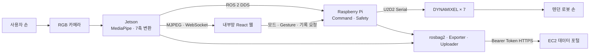

# Thing — 7축 텐던 구동 손동작 모방 로봇

> 카메라로 사용자의 오른손을 인식하고, 7개의 DYNAMIXEL과 텐던으로 구동되는 로봇 손이 동작을 실시간으로 모방하는 ROS 2 기반 시스템입니다.

[최종 시연 영상](media/videos/최종시연.mp4) · [요구사항 명세서 V7](<docs/requirements/요구사항 명세서 V7.md>) · [시스템 아키텍처](docs/architecture.md) · [ROS 2 인터페이스](docs/interfaces.md)

## 프로젝트 소개

사람 손의 많은 관절을 모두 독립 구동하는 대신, 함께 움직이는 관절을 텐던으로 연결한 **underactuated 구조**를 사용합니다. MediaPipe가 추출한 21개 손 landmark를 관절 굽힘과 엄지 동작으로 변환하고, 이를 7개 논리축에 매핑해 로봇 손을 제어합니다.

핵심 목표는 다음과 같습니다.

- 편 손·주먹과 다양한 손동작의 실시간 모방
- 원통형 물체 파지와 엄지–검지 집기
- 웹 기반 MIMIC·MANUAL 관제 및 제어
- Raspberry Pi의 독립적인 명령 검증·안전 제어
- landmark·명령·모터 상태 기록과 EC2 데이터 포털 제공

## 주요 기능

| 기능 | 설명 |
| --- | --- |
| MIMIC | Jetson 카메라와 MediaPipe로 오른손을 인식해 7축 명령 생성 |
| MANUAL | 내부망 웹에서 사전 정의된 자세와 연속 동작 실행 |
| TELEOP | 로컬 키보드로 개별 축 시험 및 제어 |
| 실시간 관제 | MJPEG 영상, landmark, 7축 목표, 모터·안전·기록 상태 표시 |
| 안전 제어 | 제어권 중재, 명령 범위·변화율 검증, watchdog, E-Stop 및 안전 복구 |
| 데이터 기록 | MIMIC 세션을 rosbag2로 기록하고 성공·실패 판정 후 4개 파일로 변환 |
| 데이터 포털 | 완료된 세션을 EC2에 업로드하고 조회·다운로드 제공 |

## 7개 논리축

| 축 | 역할 |
| --- | --- |
| `thumb_flex` | 엄지 굽힘 |
| `thumb_opposition` | 엄지 대립 |
| `thumb_abduction` | 엄지 벌림 |
| `index_flex` | 검지 굽힘 |
| `middle_flex` | 중지 굽힘 |
| `ring_flex` | 약지 굽힘 |
| `little_flex` | 소지 굽힘 |

각 논리축은 XL330-M288-T 7개와 1:1로 연결하며, 모터 ID·버스·방향·위치 범위는 YAML 설정으로 관리합니다.

## 시스템 아키텍처



- **Jetson Orin Nano:** 카메라, MediaPipe, 7축 목표 생성, MJPEG, Web Bridge, Logger·Exporter·Uploader
- **Raspberry Pi 5:** 제어권 중재, 명령 검증, 안전 상태 관리, DYNAMIXEL 제어
- **내부망 웹:** 실시간 상태 확인과 MIMIC·MANUAL 운용
- **AWS EC2:** 완료된 세션의 읽기 전용 조회·다운로드

웹과 EC2는 모터에 직접 접근하지 않습니다. 모든 일반 제어 명령은 Raspberry Pi의 `command_manager`와 `command_guard`를 통과합니다.

## 데이터 흐름

카메라는 항상 실행하지만 영상 파일은 저장하지 않습니다. MIMIC 모드에서 기록을 시작하면 rosbag2에 landmark, 명령, 모터 및 상태 토픽을 저장합니다. 기록 종료 후 성공·실패 판정이 완료되면 다음 4개 파일을 생성합니다.

```text
session_{id}_metadata.json
session_{id}_hand_command.csv
session_{id}_motor_status.csv
session_{id}_landmark.json
```

완료된 파일은 Jetson의 격리 uploader가 HTTPS로 EC2에 전송합니다. EC2 포털은 저장된 READY 세션만 공개하며 로봇 제어 기능은 제공하지 않습니다.

## 기술 스택

| 영역 | 기술 |
| --- | --- |
| Robot Middleware | ROS 2 Humble, Cyclone DDS, rosbag2 |
| Vision | Python, OpenCV, MediaPipe Hand Landmarker |
| Control·Hardware | Python, C++, DYNAMIXEL SDK, U2D2, XL330-M288-T |
| Internal Web | React, Vite, WebSocket, MJPEG |
| Data Portal | Django, Django REST Framework, SQLite, Gunicorn, Nginx |
| Edge·Infra | Jetson Orin Nano, Raspberry Pi 5, Docker, AWS EC2 |
| Collaboration | GitLab, Jira, Notion |

## 저장소 구성

```text
S15P11C103/
├─ thing_ws/                 ROS 2 패키지와 장치별 bringup
├─ web/                      내부망 React 관제·제어 웹
├─ EC2/thing_database_web/   EC2 데이터 포털
├─ mechanical/              CAD·STL·조립 자료
├─ electronics/             BOM·배선·전원·E-Stop 자료
├─ vision/                   비전 실험과 캘리브레이션 자료
├─ deploy/                   Jetson·Raspberry Pi 배포 자료
├─ exec/                     원격 시연 실행·종료 스크립트
├─ scripts/                  Jetson 통합 실행 스크립트
├─ tests/                    통합 시험 절차와 결과
├─ media/                    최종 시연 영상
└─ docs/                     요구사항·아키텍처·인터페이스·설정 문서
```

## 시작하기

### 1. 저장소 받기

최종 제출본은 `main`, 기능 개발은 `develop`을 기준으로 합니다. 대용량 기구·영상 파일을 위해 Git LFS가 필요합니다.

```bash
sudo apt install git-lfs
git lfs install
git clone --branch main \
  https://lab.ssafy.com/s15-webmobile3-sub1/S15P11C103.git
cd S15P11C103
git lfs pull
```

### 2. ROS 2 빌드

Ubuntu 22.04와 ROS 2 Humble 환경에서 실행합니다.

```bash
source /opt/ros/humble/setup.bash
cd thing_ws
rosdep install --from-paths src --ignore-src -r -y
colcon build --symlink-install
source install/setup.bash
colcon test
colcon test-result --verbose
```

### 3. 장치별 설정

- [Ubuntu 공통 설정](docs/setup/ubuntu.md)
- [네트워크·ROS_DOMAIN_ID 설정](docs/setup/network.md)
- [Jetson 설정](docs/setup/jetson.md)
- [Raspberry Pi 설정](docs/setup/raspberry-pi.md)
- [DYNAMIXEL 설정](docs/setup/dynamixel.md)
- [Windows–Raspberry Pi SSH 실행 설정](exec/ssh-key-auth.md)

모터 ID와 보정값은 `thing_ws/src/thing_bringup/config/motors.yaml`, 카메라·MJPEG·WebSocket 설정은 `thing_ws/src/thing_bringup/config/vision.yaml`을 기준으로 합니다. 실제 하드웨어에서 검증하지 않은 제한값으로 안전 조건을 완화해서는 안 됩니다.

### 4. 실행

Raspberry Pi 제어 스택은 시연 PC에서 다음 스크립트로 시작할 수 있습니다.

```powershell
.\exec\start_rpi_demo.ps1
```

Jetson에서는 빌드된 컨테이너와 웹 의존성을 준비한 뒤 Vision, Logger·Uploader, Web Bridge와 프론트엔드를 함께 실행합니다.

```bash
bash scripts/run_jetson_vision_web.sh
```

개별 ROS 2 구성요소는 다음 launch 파일로 실행할 수 있습니다.

```bash
ros2 launch thing_bringup vision.launch.py
ros2 launch thing_bringup logger.launch.py
ros2 launch thing_bringup web_bridge.launch.py
ros2 launch thing_bringup control.launch.py
```

상세 실행 조건과 환경변수는 각 설정 문서 및 하위 README를 확인하세요.

## 안전 원칙

- 모터 전원은 컴퓨팅 장치와 분리하고 물리적 E-Stop으로 차단합니다.
- 웹·Jetson·네트워크 장애와 관계없이 Raspberry Pi가 안전 제한을 수행합니다.
- 범위 초과·비정상·stale 명령은 실행하지 않습니다.
- SAFE·FAULT·ESTOP 복구 후 이전 모드와 명령을 자동으로 재실행하지 않습니다.
- 실제 로봇 연결 전 저속·저전류 조건에서 모터 ID와 방향을 확인합니다.

자세한 정책은 [Safety Manager](docs/safety_manager.md)와 [DYNAMIXEL 안전 지침](docs/motor-control/dynamixel/safety.md)을 참고하세요.

## 주요 문서

- [요구사항 명세서 V7](<docs/requirements/요구사항 명세서 V7.md>)
- [시스템 아키텍처](docs/architecture.md)
- [ROS 2 및 WebSocket 인터페이스](docs/interfaces.md)
- [내부망 웹](web/README.md)
- [Web Bridge](thing_ws/src/thing_web_bridge/README.md)
- [Logger·Exporter](thing_ws/src/thing_logger/README.md)
- [EC2 데이터 포털](EC2/README.md)
- [업로더 통합 시험](<docs/uploader-통합시험-절차.md>)
- [기여 및 브랜치 규칙](CONTRIBUTING.md)

## MVP 제외 범위

VLA·Imitation Learning 학습, Isaac Sim/Lab, 촉각 센서, 모든 관절의 독립 제어와 외부 인터넷을 통한 로봇 원격 제어는 현재 범위에 포함하지 않습니다. MediaPipe 기반 규칙 제어를 우선 사용하며, 학습 기반 관절 오차 보정 모델은 향후 확장 항목입니다.
