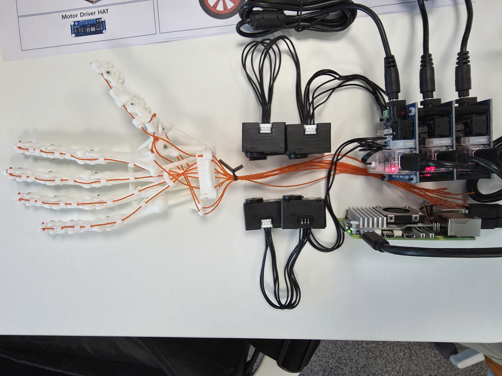

# Daily Report

- 날짜: 2026-07-27
- 작성자: 공세민
- 관련 Jira 작업: [S15P11C103-62](https://ssafy.atlassian.net/browse/S15P11C103-62)

## 오늘 한 일

- DYNAMIXEL **XL330-M288** 제어 환경을 구성하고, PC에서 모터 제어 및 정상 동작 여부를 확인함.
- 통신 상태와 모터 상태를 점검하여 이상 여부를 확인함.
- 위치·속도 제어를 위한 DYNAMIXEL SDK 활용 가능성을 검토함.
- Raspberry Pi와 Jetson Orin Nano 적용을 고려하여 U2D2 기반 연결 방식을 정리함.
- 전완부 내부 구성요소의 배치 방향을 검토하고, 모터 및 구동부를 고려한 전완부 배치도 구상을 완료함.

## 결과 및 확인 자료

- 커밋/MR: 해당 없음
- 사진·영상·측정값: XL330-M288의 PC 제어 및 통신 상태 정상 동작 확인

## 막힌 점 또는 위험 요소

- Raspberry Pi 또는 Jetson Orin Nano 환경에서 SDK 기반 제어 코드의 실제 적용 및 검증이 필요함.

## 다음 작업

- 전완부 배치도를 기반으로 상세 치수와 기구 설계를 진행함.
- Raspberry Pi 또는 Jetson Orin Nano 환경에서 SDK 기반 제어 코드를 적용하고 동작을 검증함.
