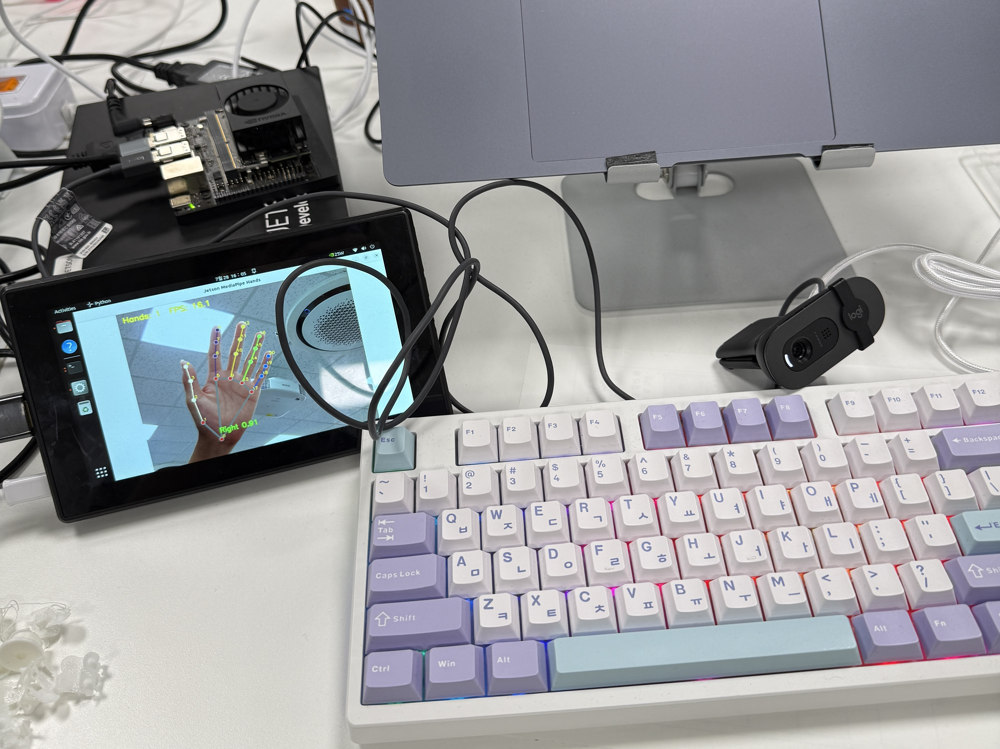

# Daily Report

- 날짜: 2026-07-28
- 작성자: 윤정민
- 관련 Jira 작업: [S15P11C103-121](https://ssafy.atlassian.net/browse/S15P11C103-121)

## 오늘 한 일

- Jetson Orin Nano Super의 아키텍처와 시스템 버전을 확인하고, `aarch64`·L4T `36.4.7` 환경에서 `dustynv/ros:humble-desktop-l4t-r36.4.0` 이미지를 사용할 수 있는지 검토함.
- Docker 이미지를 manifest digest `sha256:b8ee30b1ae189cfeeea755a7fd6b8aea74267f5c1bc0cfa4f19a6acec9d941e5`로 고정하여 내려받고, 이미지의 `arm64` 아키텍처와 digest 일치 여부를 확인함.
- NVIDIA Container Runtime으로 ROS 2 Humble 컨테이너를 실행하고 RViz2, `rmw_cyclonedds_cpp`, CUDA 드라이버 라이브러리와 TensorRT `10.4.0`을 확인함.
- 반복 개발을 위해 `thing-jetson-full` persistent 컨테이너 실행 스크립트를 구성함. NVIDIA runtime, host network, `ROS_DOMAIN_ID=103`, CycloneDDS RMW, X11 화면 출력, 웹캠 및 Jetson 호스트 파일 접근 설정을 적용함.
- 컨테이너에서 RViz2를 실행하여 Jetson 물리 화면 출력과 OpenGL `4.6` 사용을 확인함.
- `/dev/video0`과 `/dev/video1`을 확인하고, OpenCV로 `/dev/video0`의 `640×480 @ 30 FPS` 영상 입력과 실시간 GUI 출력을 검증함.
- MediaPipe Hands 실행용 Python 가상환경과 `webcam_mediapipe.py`를 구성함. Jetson 전용 pip 저장소의 DNS 오류를 확인한 뒤, 명령 단위로 공식 PyPI를 지정하여 MediaPipe `0.10.9`와 호환 의존성을 설치함.
- 웹캠 영상에서 손 1개의 21개 랜드마크, handedness와 confidence를 실시간으로 표시하는 동작을 확인함.

## 결과 및 확인 자료

- 커밋/MR: 작성 예정
- 사진·영상·측정값:
  - Jetson: NVIDIA Jetson Orin Nano Super, `aarch64`, L4T `36.4.7`
  - 컨테이너: ROS 2 Humble, `rmw_cyclonedds_cpp`, CUDA 로드 정상, TensorRT `10.4.0`
  - RViz2: Jetson 물리 화면 출력 및 OpenGL `4.6` 확인
  - 웹캠: `/dev/video0`, `640×480 @ 30 FPS` 입력 확인
  - MediaPipe Hands 사진 촬영 시점 표시값: `16.1 FPS`, `Hands: 1`, `Right 0.91`

## 막힌 점 또는 위험 요소

- Jetson 이미지의 기본 pip 저장소가 `jetson.webredirect.org`로 설정되어 있었고 DNS 조회가 실패하여 일반 Python 패키지를 찾지 못함. 전역 설정을 지우지 않고, 일반 패키지 설치 명령에서만 공식 PyPI를 지정해 우회함.
- `thing-jetson-full` 컨테이너는 개발 편의를 위해 privileged 권한과 호스트 파일 시스템 쓰기 권한을 사용하므로, 컨테이너 내부의 잘못된 명령이 Jetson 호스트에 직접 영향을 줄 수 있음.
- 현재 설치한 패키지는 persistent 컨테이너 내부 상태에 의존하므로, 컨테이너를 `--recreate`하면 설치 내용이 사라질 수 있음. 재현 가능한 설치 절차를 별도 스크립트나 이미지 정의로 정리할 필요가 있음.
- MediaPipe의 `16.1 FPS`는 사진 촬영 시점의 표시값이며, 장시간 평균 성능 측정 결과는 아님.
- 여러 PC 사이의 CycloneDDS 통신은 Jetson IP를 peer 목록에 반영한 뒤 실제 팀 장비를 연결하여 최종 검증해야 함.

## 다음 작업

- Jetson의 실제 LAN IP를 `cyclonedds.xml` peer 목록에 반영하고, `ssafy-worker`와 `ROS_DOMAIN_ID=103` 기반 토픽 송수신을 확인함.
- MediaPipe Hands의 랜드마크 결과를 ROS 2 토픽으로 발행하고, worker에서 수신·시각화하는 구조를 구현함.
- 카메라 해상도와 MediaPipe 모델 복잡도별 처리 FPS를 일정 시간 측정하여 평균·최소 FPS를 기록함.
- persistent 컨테이너의 패키지 설치 및 실행 절차를 재현 가능한 설정 파일이나 설치 스크립트로 정리함.
