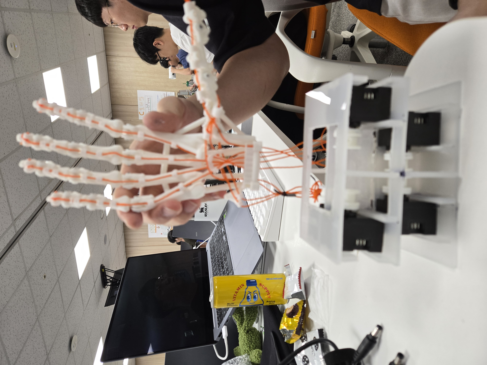
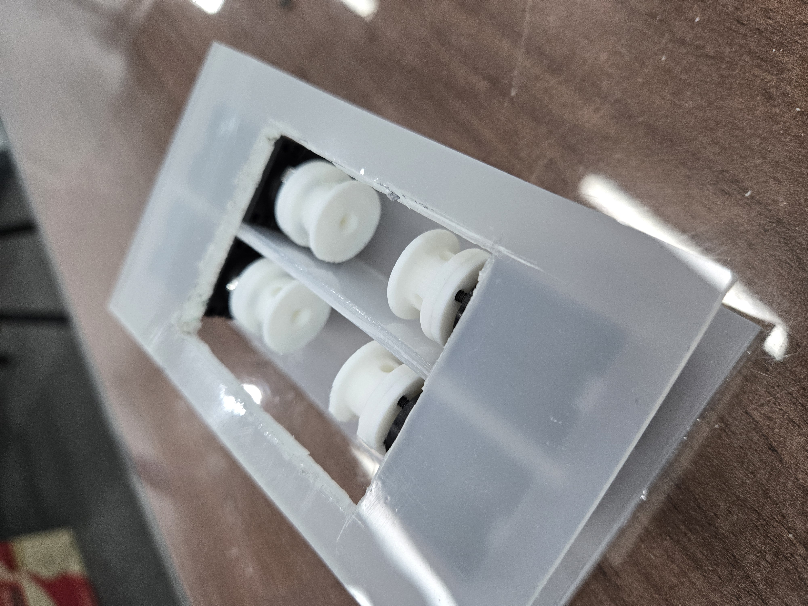
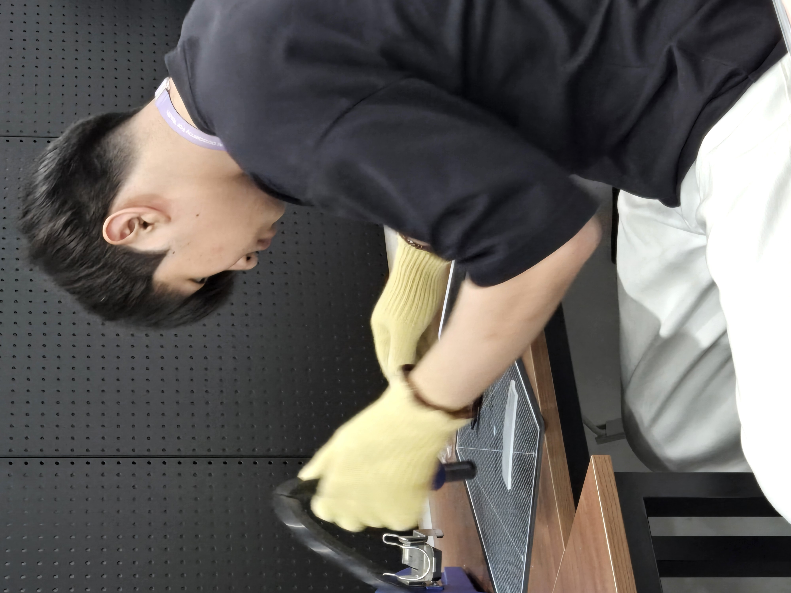

# Daily Report

- 날짜: 2026-07-29
- 작성자: 공세민
- 관련 Jira 작업: [S15P11C103-114 전완부 부품 3D 프린팅 및 재가공](https://ssafy.atlassian.net/browse/S15P11C103-114)

## 오늘 한 일

- 전완부 내부에 XL330 모터를 장착하기 위한 아크릴 고정부 설계를 완료함.
- 아크릴 고정부를 가공하고, 모터·스풀을 전완부 내부에 장착함.
- 전완부 프레임, 모터 고정부, 로봇 손을 조립하여 실제 조립 구조를 확보함.
- 모터 체결 위치와 전완부 내부 배치를 기준으로 텐던·케이블 경로를 구성함.

## 결과 및 확인 자료

- 전완부 모터 고정용 아크릴 고정부의 설계·가공·조립을 완료함.
- XL330 모터와 스풀의 전완부 내부 장착 위치 및 체결 방향을 확인함.
- 후속 간섭·강도 검증에 사용할 실물 조립 구조를 확보함.

### 전완부 및 로봇 손 조립 상태

### 아크릴 고정부 내부 모터·스풀 장착 상태

### 아크릴 고정부 가공 과정

## 막힌 점 또는 위험 요소

- 실제 구동 시 텐던·케이블·스풀과 전완부 프레임 사이의 간섭 여부를 확인해야 함.
- 반복 구동에서 아크릴 고정부의 변형, 나사 풀림 및 모터 체결 강도를 검증해야 함.
- 검증 결과에 따라 홀 위치, 두께 또는 보강 구조의 재가공이 필요할 수 있음.

## 다음 작업

- 모터 구동 상태에서 텐던·케이블·스풀 간섭을 점검함.
- 반복 동작을 통해 아크릴 고정부와 모터 체결부의 강도를 확인함.
- 검증 결과에 따라 고정부 형상을 보완하거나 재가공함.
