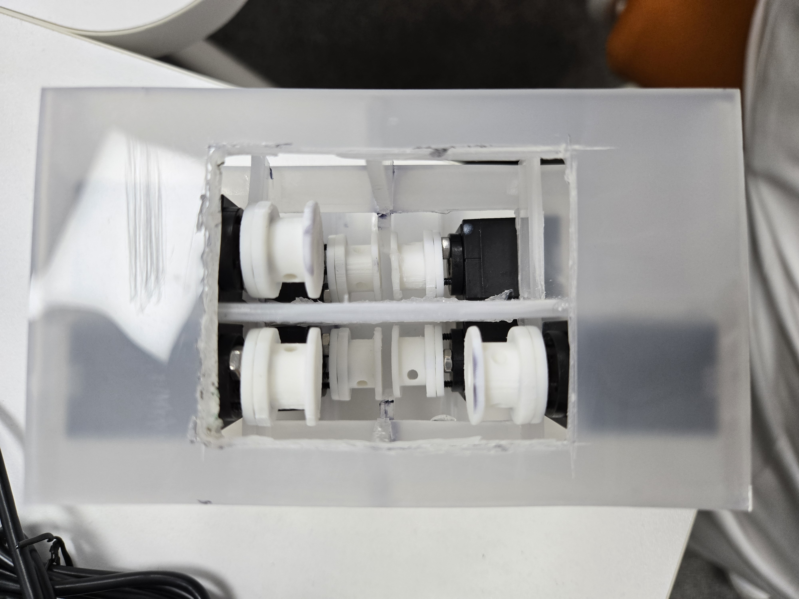
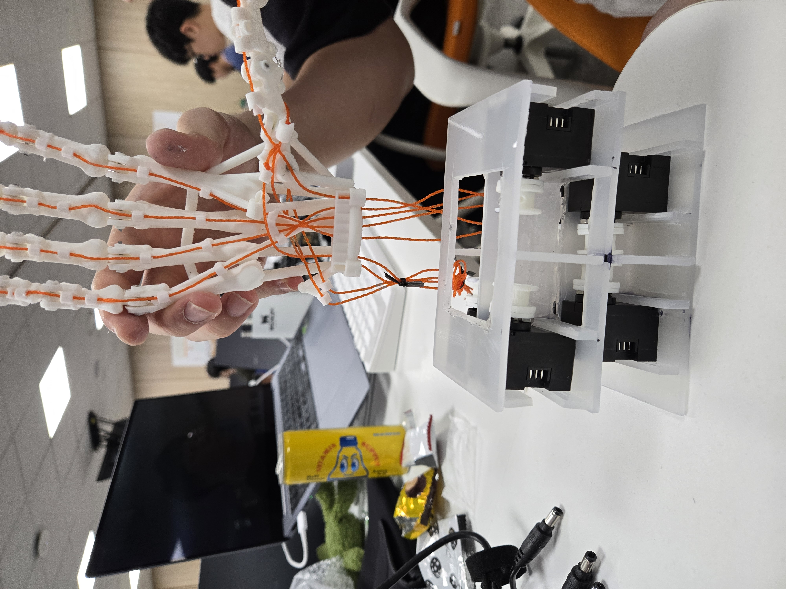

# Daily Report

- 날짜: 2026-07-29
- 작성자: 백지웅
- 관련 Jira 작업: [S15P11C103-114](https://ssafy.atlassian.net/browse/S15P11C103-114) 전완부 제작 담당자 작업 협업

## 오늘 한 일

- 본인 담당 이슈는 아니지만 전완부 제작 담당자와 협업하여 로봇 손 아래에 결합할 전완부 구조를 제작함.
- 전완부 내부에 DYNAMIXEL 모터가 들어갈 위치를 정하고, 모터를 수용·고정하는 프레임 구조를 제작함.
- 모터와 스풀이 전완부 내부에서 배치되는 상태를 확인하고, 각 부품이 움직이지 않도록 고정되는 부분까지 완성함.
- 로봇 손을 전완부 위에 임시로 올려 향후 손과 전완부가 연결될 형태와 텐던이 내려오는 방향을 확인함.
- 현재 단계에서는 손과 전완부를 실제로 체결하지 않았으며, 손을 올려둔 상태로 전체 연결 형태만 점검함.

## 결과 및 확인 자료

- 커밋/MR: 작성 예정
- 사진·영상·측정값:
  - 전완부 내부 모터 고정 구조 상세

    

  - 손–전완부 연결 형태 확인을 위한 임시 배치

    

## 막힌 점 또는 위험 요소

- 현재는 모터 고정부만 완성된 상태이며 로봇 손과 전완부의 실제 체결 구조는 추가 제작이 필요함.
- 텐던을 각 모터 스풀까지 연결할 때 텐던 간 간섭, 꺾임 및 마찰이 발생하지 않는지 확인이 필요함.
- 모터 구동 시 발생하는 하중과 진동에도 고정부가 변형되거나 이탈하지 않는지 실물 검증이 필요함.
- 모터와 스풀의 위치에 따라 전완부 내부 공간이 부족하거나 정비 접근성이 떨어질 수 있어 최종 조립 전 간섭 확인이 필요함.

## 다음 작업

- 로봇 손과 전완부를 실제로 결합할 체결 구조를 제작하고 정렬 상태를 확인함.
- 손에서 내려오는 텐던을 각 모터 스풀에 연결하고 텐던 경로와 장력을 조정함.
- 모터 및 스풀 회전 시 전완부 프레임과 간섭이 없는지 확인함.
- 모터 구동 시험을 통해 고정부의 강성, 흔들림 및 이탈 여부를 검증함.
