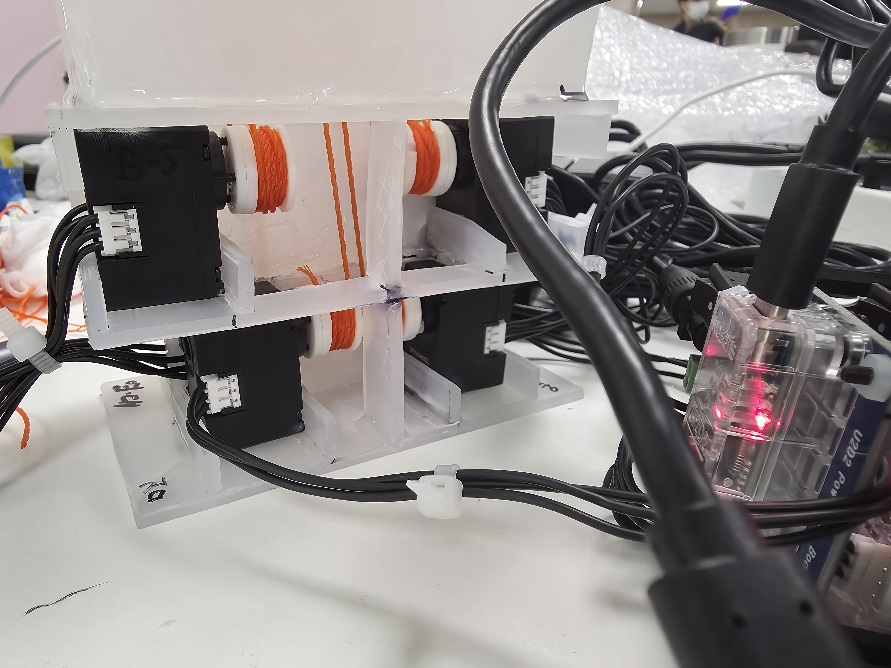
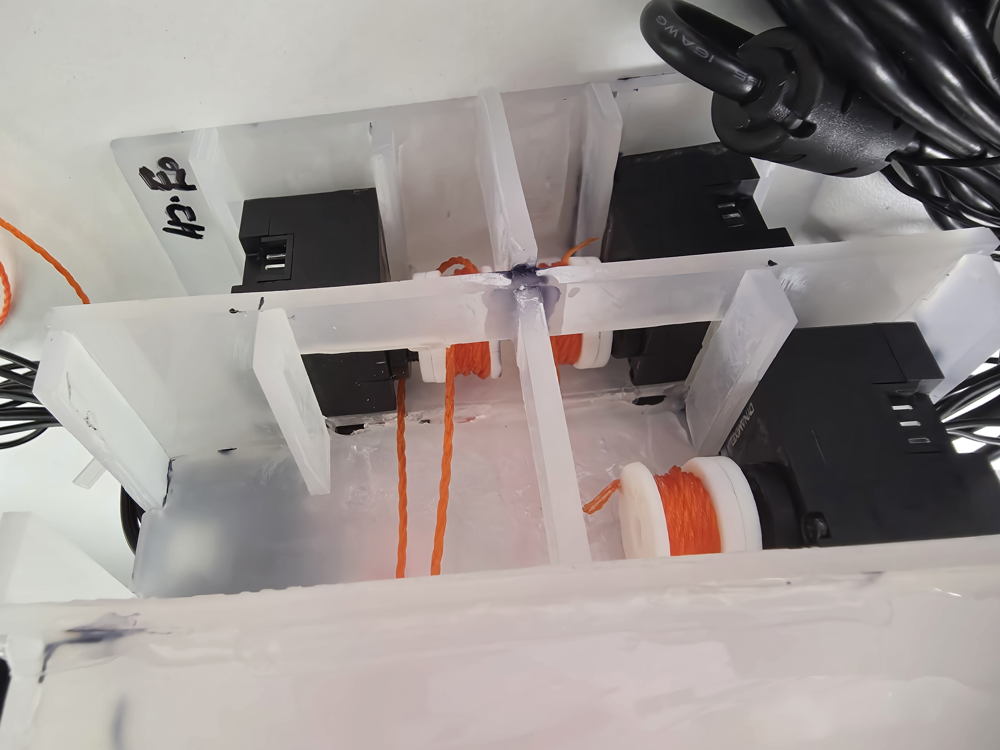

# Daily Report

- 날짜: 2026-07-31
- 작성자: 공세민
- 관련 Jira 작업: [S15P11C103-39](https://ssafy.atlassian.net/browse/S15P11C103-39), [S15P11C103-41](https://ssafy.atlassian.net/browse/S15P11C103-41)

## 오늘 한 일

- 7개 모터 배치에 맞춰 손가락별 스풀과 텐던 연결 상태를 정리했다.
- 스풀 권취부와 텐던 가이드 주변의 연결 경로를 촬영해 정비·재장착 시 참고할 수 있도록 기록했다.
- 손가락·엄지·텐던·모터 하우징을 포함한 로봇 손 기구 통합 조립 상태를 확인했다.

## 결과 및 확인 자료

- 스풀·텐던 연결 상태 1

  

- 스풀·텐던 연결 상태 2

  

- 전체 로봇 손 기구 통합 조립 상태

  

- 커밋/MR: Week 04 공세민 데일리 리포트 MR에서 관리

## 막힌 점 또는 위험 요소

- 텐던 초기장력과 스풀 권취 상태는 구동 전 축별로 다시 확인해야 한다.
- 최대 가동 범위에서 텐던 간 마찰·꼬임, 기구 간섭, 고정부 강도 검증이 남아 있다.
- 소프트웨어 통합 시험 전 전원 케이블 정리와 물리 안전장치 준비 상태를 점검해야 한다.

## 다음 작업

- 각 축의 텐던 장력과 스풀 감김 방향을 조정하고 재장착 절차를 보완한다.
- 손 펴기·주먹·엄지–검지 접촉 자세에서 간섭과 가동 범위를 확인한다.
- 구동 전 고정부 강도와 물리 안전장치를 검토한다.
