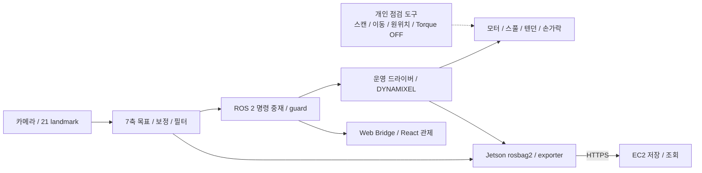

# THING — 구동·기구 통합 기술 노트

[프로젝트 개요·시연·실행 방법](../README.md)으로 돌아가기

기존 상세 포트폴리오의 구현 설명을 저장소의 코드·작업일지와 연결한 문서입니다.
2026-09-12 확인 기준은 [main `fbfdfceb`](https://github.com/SeMinKong/THING/tree/fbfdfcebf1f0421a8b9fad400f93731984f0132b)입니다.
아래 수식의 예시는 계산 설명이며, 문서 작성 과정에서 새 실물 시험을 수행하지 않았습니다.

## 공세민의 구현 경험

2026-09-12 작성자 확인·승인 원고입니다.

### 직접 맡은 구현

- Codex의 Blender 스킬을 활용해 인체 손의 관절 구조를 모방한 모델을 설계하고, 3D 프린팅으로 제작했습니다.
- DYNAMIXEL 모터 7개의 제어값을 조정하고, 동기 구동과 키보드 기반 조작 기능을 구현했습니다.
- U2D2 기반 모터 통신 모듈을 구성하고, 제어 노드에서 전달한 데이터를 모터 명령으로 변환하는 ROS 브릿지를 구현했습니다.

### 트러블슈팅

- **모터 제어 범위 조정**: DYNAMIXEL SDK의 전류 제한, 토크 설정, 회전 범위, 제어 모드별 동작을 확인했습니다. 각 파라미터가 구동에 미치는 영향을 비교하며 로봇손의 기구 조건에 맞게 제어값을 조정했습니다.
- **텐던 구동과 복귀 구조**: 손가락을 굽히는 동작과 원위치로 복귀하는 동작을 함께 고려해야 했습니다. 관절의 힘 작용점을 계산하고 텐던 배치를 검토해, 장력을 이용하는 복귀 방식으로 구조를 변경했습니다.
- **ROS 통신 주기 개선**: 제어 명령의 전달 주기를 개선하기 위해 ROS 통신 설정을 조정하고 Cyclone DDS를 활용했습니다. 모터 구동과 데이터 전달을 함께 점검하며 실시간 제어를 위한 통신 환경을 구성했습니다.

### 회고

Physical AI를 위한 시뮬레이션 학습까지 진행하지는 못했지만, 로봇의 기구와 모터 제어를 연결하는 기초를 익혔습니다. 제작 과정에서 통신 오류와 하드웨어 한계를 경험하며 소프트웨어만으로 해결하기 어려운 조건들을 이해했습니다. 이를 바탕으로 기구·통신 구조를 개선하고, 이후 시뮬레이션 학습과 실제 제어를 연결할 프로젝트를 구상하고 있습니다.

## 기여 범위와 시스템 연결

| 구분 | 구현·기여 |
| --- | --- |
| 공세민 | Blender 모델링·3D 프린팅, U2D2·SDK 통신, 7개 모터 동기 구동·키보드 제어, ROS 브릿지·Cyclone DDS 설정, 고정부·스풀·텐던 통합 |
| 팀 | MediaPipe 인식, 7축 목표 계산, ROS 2 명령 중재·guard·안전 상태, 관제 UI·기록·업로드 |
| 팀 시연 | 손동작 모방, 순차 손가락 동작, 캔·유연 물체 파지 |

새 담당 범위는 위 작성자 확인 원고를 기준으로 합니다. 공개 일지로 확인할 수 있는 일부 작업은 [7월 28일 제어 일지](daily-reports/2026-07-28/2026-07-28-공세민.md),
[7월 29일 고정부 제작](daily-reports/2026-07-29/2026-07-29-공세민.md),
[7월 31일 기구 통합](daily-reports/2026-07-31/2026-07-31-공세민.md)에 기록되어 있습니다.



Jetson은 인식·기록을, Raspberry Pi는 명령 중재와 모터 제어를 맡습니다.
ROS 2 DDS는 내부 통신이며 Jetson에서 EC2로 보내는 기록은 HTTPS를 사용합니다.
웹 명령도 중재·검사를 거칩니다. 전체 상태 전이와 인터페이스는
[아키텍처](architecture.md), [인터페이스](interfaces.md), [Safety Manager](safety_manager.md)를 참고하세요.

## 개인 구현: 이동 전에 초기 목표를 일치시키기

Torque ON 시 모터에 남아 있는 이전 Goal Position으로 이동하는 상황을 피하기 위해,
키보드의 **이동 함수**는 다음 순서를 사용합니다.

```text
Present Position 읽기
  → 속도·가속도 / Goal PWM·Current 설정
  → Goal Position = 현재 위치
  → Torque ON
  → Goal Position = 현재 위치 + 이동량
```

일반 위치 모드(Mode 3)에서는 새 목표를 0–4095로 제한합니다.
키보드 기본 이동량은 32 raw이며 위·아래 키는 그 네 배입니다.
`Space`는 선택 축, `s`는 전체 축 Torque OFF를 요청하고, 기본 종료 경로도 전체 축 토크를 끕니다.
통신 실패는 오류로 보고됩니다.

현재 위치를 초기 목표로 기록한 뒤 토크를 켜는 순서는 `move()`와 `home_one()`에 공통입니다. 별도의 `t` 토크 토글은
직접 Torque Enable만 바꾸므로, 모든 Torque ON 경로에 초기 목표 동기화가 있다고 해석하면 안 됩니다.
Torque OFF 명령 자체도 기구적 정지나 안전 인증을 뜻하지 않습니다.

근거: [keyboard_control_7.py의 move](https://github.com/SeMinKong/THING/blob/fbfdfcebf1f0421a8b9fad400f93731984f0132b/tools/dynamixel/rpi/keyboard_control_7.py#L139),
[현장 점검 도구 안내](../tools/dynamixel/rpi/README.md).

## 개인 구현: 다회전 원위치와 기구 편차

`home_all_7.py`는 ID 1–7을 한 축씩 중앙각으로 이동합니다.
Mode 3의 목표는 2048이며, Mode 4/5는 현재 좌표에 가장 가까운 같은 중앙각을 선택합니다.

```text
k = round((present - 2048) / 4096)
target = 2048 + 4096 × k

예: present = 5480 → k = 1 → target = 6144
```

기본 동작은 도착 허용 오차 안에 들어오거나 시간초과가 발생한 뒤 Torque OFF를 시도합니다.
`--keep-torque`는 토크 유지 옵션입니다. 이 도구는 중앙각 복귀 도구이며,
손가락의 실제 편 자세·최대 굽힘·텐던 장력을 자동 보정하지 않습니다.
[원위치 계산과 종료 처리](https://github.com/SeMinKong/THING/blob/fbfdfcebf1f0421a8b9fad400f93731984f0132b/tools/dynamixel/rpi/home_all_7.py#L53)

기구에서는 아크릴 고정부를 가공해 모터·스풀을 전완부에 장착하고,
텐던과 케이블 경로를 구성했습니다. 스풀 권취 방향·초기 장력·손가락 가동 범위가 다르면
같은 엔코더 목표라도 실제 굽힘이 달라집니다. 따라서 통신 확인과 기구 동작 확인을 구분하고,
체결 방향과 텐던 경로를 사진·작업일지에 남겼습니다.

당시 일지에는 축별 끝점 보정, 최대 범위의 간섭·마찰·꼬임, 고정부 강도와 반복 구동 검증이
후속 과제로 남아 있습니다. 조립 사진은 제작 근거이며 재조립 반복성의 정량 결과는 아닙니다.

## 팀 구현: 21개 landmark에서 7축 목표까지

논리 축은 네 손가락 굽힘, 엄지 굽힘·대립·외전의 총 7개입니다.
입력은 영상 기준 `landmarks`의 21개 좌표이며 현재 함수가 `world_landmarks`를 받는 것은 아닙니다.

관절의 앞·뒤 점을 향하는 벡터를 각각 `a`, `b`라고 하면 다음과 같이 계산합니다.
아래 각도 표현은 도 단위로 바꾼 설명이며 구현은 라디안을 사용합니다.

```text
theta = acos(dot(a, b) / (norm(a) × norm(b)))
bend = clip((180° - theta) / 125°, 0, 1)
flex = clip(0.65 × proximal_bend + 0.35 × distal_bend, 0, 1)
```

일반 손가락은 PIP·DIP, 엄지는 MCP·IP의 굽힘을 가중 합산합니다.

| 축 | 계산 |
| --- | --- |
| 엄지 대립 | 엄지 끝–손바닥 중심 거리 / 손바닥 폭을 0.20–1.25 구간에서 역정규화 |
| 엄지 외전 | CMC→엄지 끝과 CMC→검지 MCP 방향을 손바닥 평면에 투영한 뒤 사이각 10–65°를 정규화 |
| 사용자 보정 | 각 축의 `(raw - min) / (max - min)`을 0–1로 제한 |

보정 범위는 [vision.yaml](../thing_ws/src/thing_bringup/config/vision.yaml)에 있습니다.
특히 엄지 외전 범위는 평면 투영 계산 이후 새 표본으로 재보정하기 전 설정입니다.
설정 파일의 과거 world-landmark 주석과 실제 입력 경로를 구분해야 합니다.
[관절·엄지 계산 코드](https://github.com/SeMinKong/THING/blob/fbfdfcebf1f0421a8b9fad400f93731984f0132b/thing_ws/src/thing_vision/thing_vision/hand_target_node.py#L183)

## 팀 구현: 필터와 엔코더 매핑

첫 유효 보정 표본은 필터 시작점으로 사용합니다. 이후 landmark callback마다 다음 순서가 적용됩니다.

```text
abs(current - previous) ≤ 0.02 → previous 유지
그 외:
  low_pass = previous + 0.25 × (current - previous)
  delta = clip(low_pass - previous, -0.08, +0.08)
  filtered = clip(previous + delta, 0, 1)
```

필터는 모터 쓰기마다가 아니라 landmark callback마다 실행되므로 입력 처리 빈도의 영향을 받습니다.
[필터 코드](https://github.com/SeMinKong/THING/blob/fbfdfcebf1f0421a8b9fad400f93731984f0132b/thing_ws/src/thing_vision/thing_vision/hand_target_node.py#L915)

일반 손가락 축의 최종 엔코더 목표는 `round(home + q × (closed - home))`입니다.
검지 설정 `home=1740`, `closed=4300`에서 `q=0.5`이면 목표는 **3020 pulse**입니다.
실제 송신 목표는 이동량 제한을 거쳐 이 값에 접근하므로 한 번에 3020을 보낸다는 뜻은 아닙니다.

엄지는 단순 끝점 보간만 사용하지 않습니다. `neutral / open / grasp / folded` 기능 자세를
선택하고, MIMIC 전환 후보는 수신 3회와 거리 margin 0.1 조건으로 안정화합니다.
기능 자세별 접근 방향·중간 위치와 굽힘 범위를 사용합니다.
[모터 매핑·자세 선택](https://github.com/SeMinKong/THING/blob/fbfdfcebf1f0421a8b9fad400f93731984f0132b/thing_ws/src/thing_hardware/src/motor_driver_node.cpp#L542),
[축·기능 자세 설정](../thing_ws/src/thing_bringup/config/motors.yaml)

## 팀 구현: 추론·발행·버스 통신의 주기 분리

| 경로 | 설정과 동작 |
| --- | --- |
| Landmark 입력 | 최신 표본 하나를 보관하는 BEST_EFFORT QoS; 계산 후 목표 캐시 갱신 |
| HandCommand 발행 | 20Hz 설정, 최신 유효 목표 반복 발행 |
| 모터 목표 쓰기 | 50Hz 설정, 버스별 Sync Write |
| 모터 상태 읽기 | 20Hz 설정 |
| 유효 입력 공백 | 250ms 기준으로 오래된 목표 폐기 |
| 명령 검사 | manager의 제어권 선택 후 guard에서 상태·시각·값 범위·변화량 검사; 명령 유효 시간의 상한은 300ms |

쓰기마다 허용하는 최대 엔코더 변화는 경과 시간을 반영합니다.

```text
pulses_per_second = profile_velocity × 0.229 × 4096 / 60
dt = clip(steady_clock 경과시간, 0, 0.25초)
step = max(1, floor(pulses_per_second × speed_limit × dt))
```

활성 비전 설정의 `speed_limit`은 1.0입니다. 이는 속도 제한 비율이며 실제 모터 속도 측정값이 아닙니다.
단일 spin과 순차 버스 I/O를 사용하므로 20/50Hz는 주기 설정이지 실측 유지 보장이 아닙니다.
[경과 시간·이동량 제한](https://github.com/SeMinKong/THING/blob/fbfdfcebf1f0421a8b9fad400f93731984f0132b/thing_ws/src/thing_hardware/src/motor_driver_node.cpp#L744),
[명령 검사](../thing_ws/src/thing_control/thing_control/command_guard_core.py)

## 확인한 결과와 남은 검증

| 근거 | 확인되는 범위 | 여기서 확정할 수 없는 것 |
| --- | --- | --- |
| 7월 28일 개인 일지 | 7개 모터 통신, Mode 5·Torque OFF 상태 확인 기록 | 현재 장비 상태, 축별 보정 완료 |
| 조립 일지와 사진 | 고정부·스풀·텐던 통합 구조 | 최대 가동 범위 간섭, 장력 편차, 반복 강도 |
| README의 팀 시연 | 모방·순차 동작·물체 파지 장면 | 지연·파지 성공률·내구성 수치 |
| 기존 포트폴리오 검토의 오프라인 테스트 | fake SDK 기반 hand-motion 테스트 5개 통과 기록 | 실물 모터·시리얼 통신 시험 |

오프라인 결과는 과거 검토 기록이며 이번 문서 작성에서 재실행한 결과가 아닙니다.
[원본 오프라인 테스트](../tests/dynamixel/test_hand_motion_offline.py),
[검토 환경·제한 기록](https://github.com/SeMinKong/SeMinKong_Web/blob/main/docs/portfolio-visual-sources.md)

[파지 시험 절차](../tests/procedures/grasp-test.md)는 물체·장력·모터 설정을 고정하고
3초 유지·10회 반복을 기록하도록 하지만 결과표는 비어 있습니다.
따라서 절차의 성공 기준을 달성한 성능으로 표시하지 않습니다.
축별 끝점 보정, 반복 파지와 재조립 후 편차는 같은 조건에서 별도로 측정해야 합니다.
