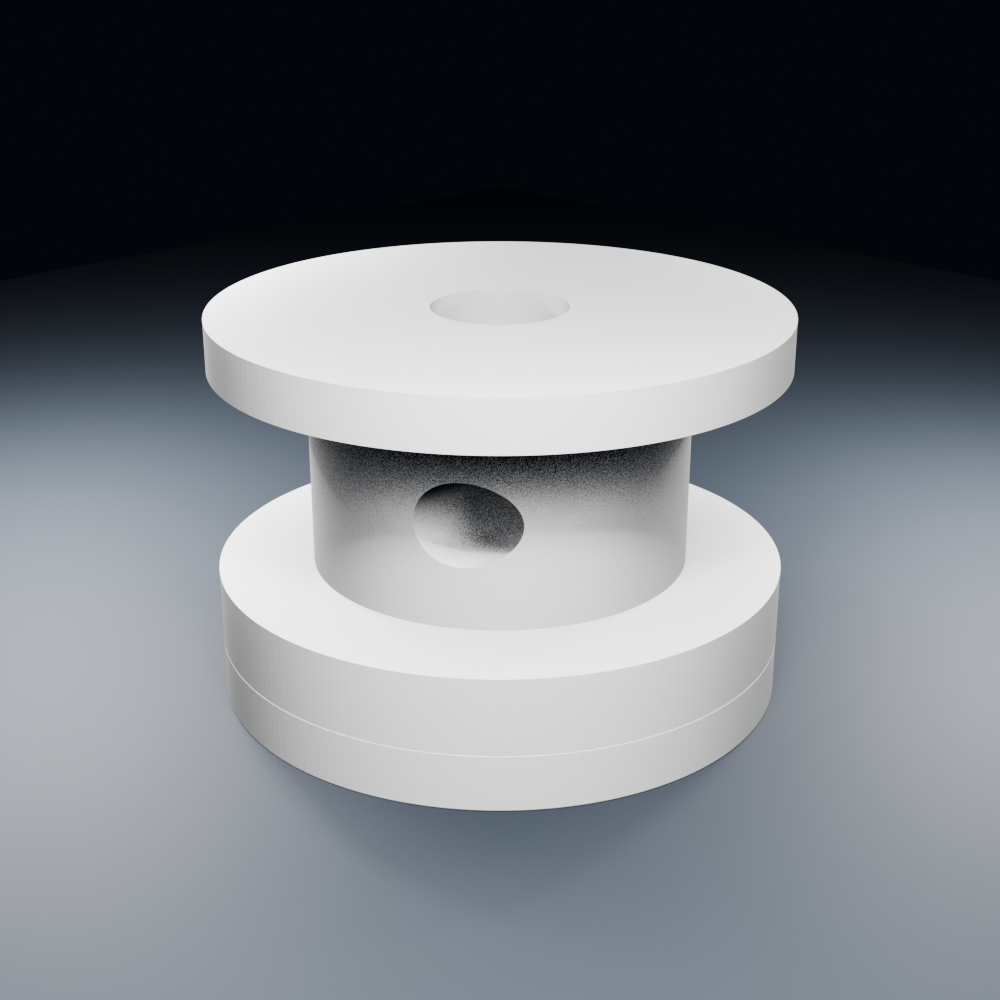
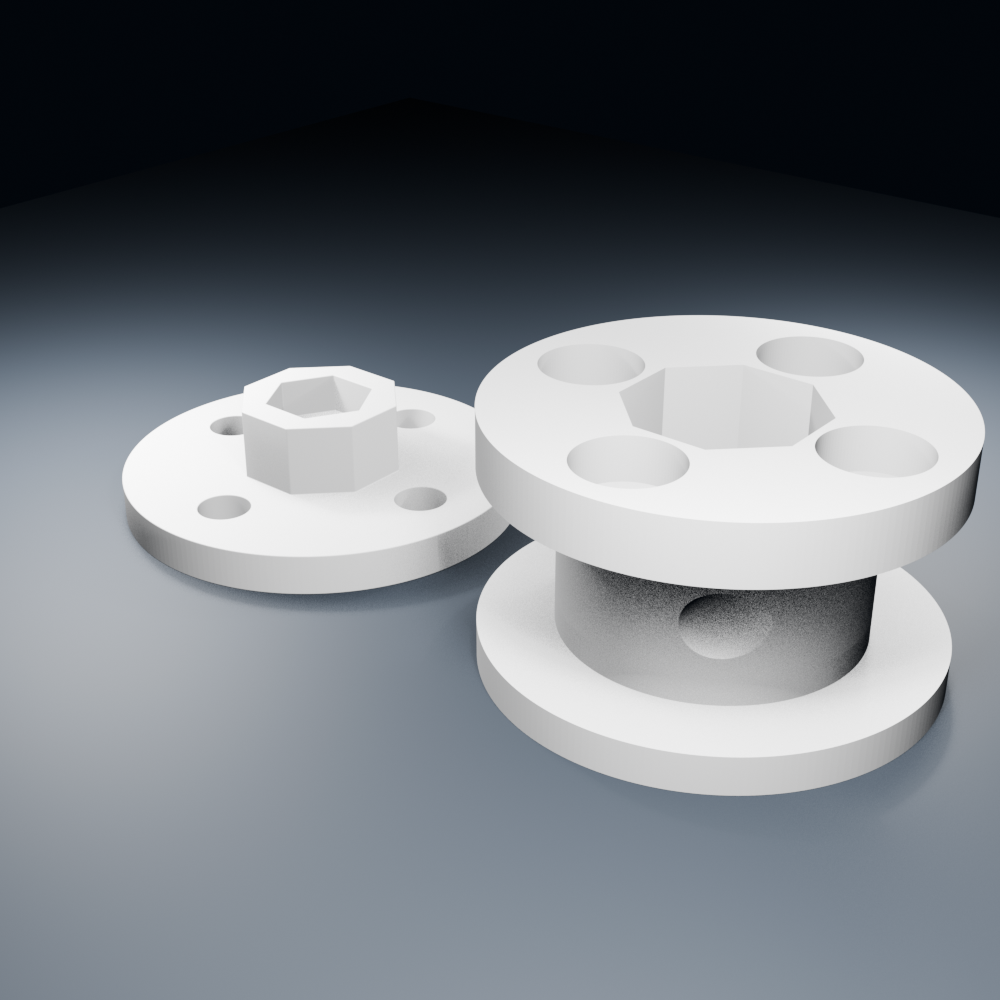

# XL330 / HNX330-N101용 Ø12 저상형 2피스 스풀

이 설계는 손가락 굽힘용 2 mm 텐던을 부드럽게 제어하기 위한 **Ø12 mm 감김 드럼**과, HNX330-N101 호른에 고정되는 **분리형 베이스**로 구성됩니다.

호른 체결 나사가 작은 드럼의 감김면을 관통하지 않도록 베이스와 드럼을 분리했습니다. 장식용 줄 형상과 나선 홈은 없습니다.





## 구성 파일

- `print/..._mount_base.stl`: 호른에 고정하는 베이스
- `print/..._drum.stl`: 2 mm 줄이 감기는 교체형 드럼
- `print/..._7set_bambu_plate.3mf`: 베이스 7개와 드럼 7개가 배치된 Bambu Studio 생산 플레이트
- `source/..._assembly.blend`: 두 부품이 결합된 Blender 원본
- `scripts/create_xl330_two_piece_spool.py`: 파라메트릭 Blender 생성 스크립트
- `scripts/validate_xl330_two_piece_spool.py`: 커밋된 STL 검증 스크립트

모델을 다시 생성하면 결과는 Git에서 제외된 `generated/`에 저장됩니다.

```bash
blender --background --python scripts/create_xl330_two_piece_spool.py
blender --background --python scripts/validate_xl330_two_piece_spool.py
```

## 주요 치수

### 드럼

| 항목 | 치수 |
|---|---:|
| 감김 코어 | Ø12.00 mm |
| 플랜지 외경 | Ø18.00 mm |
| 감김 유효 폭 | 6.50 mm |
| 줄 용량 | Ø2.00 mm 줄 1가닥 × 나란히 3회 |
| 하부 플랜지 | 2.40 mm |
| 상부 플랜지 | 1.60 mm |
| 드럼 전체 높이 | 10.50 mm |
| 팔각 허브 보어 | AF 7.25 mm × 깊이 3.60 mm |
| 중앙 체결홀 | Ø2.30 mm |
| 중앙 나사머리 자리 | Ø4.30 mm × 깊이 1.50 mm |
| 줄 고정용 가로 구멍 | Ø2.60 mm |

### 호른 베이스

| 항목 | 치수 |
|---|---:|
| 베이스 원판 | Ø18.00 × 1.80 mm |
| 호른 체결홀 | 4 × Ø2.30 mm |
| 체결홀 피치원 | PCD Ø12.00 mm |
| 팔각 토크 허브 | AF 6.80 × 높이 3.20 mm |
| 드럼과 팔각 끼움 여유 | 직경 방향 0.45 mm |
| 중앙 M2 너트 포켓 | AF 4.25 × 깊이 1.80 mm |
| 호른 중앙 나사 여유부 | Ø6.00 × 깊이 0.50 mm |
| 결합 상태 전체 높이 | 호른 면에서 12.30 mm |

모터 위치 범위 `100~3995 raw`를 전부 사용하면, 2 mm 줄 중심 기준 약 **41.824 mm**를 당깁니다. 이 값은 기하학적 최대 환산값이며 실제 손에서는 사용하지 않습니다. 텐던 연결 후 축별 안전 끝점을 작은 조그로 따로 보정해야 합니다.

## 필요한 체결 부품

- 호른 체결: **PHS M2×4 4개**
  - HNX330-N101에 포함된 나사를 사용할 수 있습니다.
- 드럼 체결: **M2×8 나사 1개**
  - 냄비머리 또는 버튼머리
  - 실제 나사머리 외경은 4.1 mm 이하 권장
- 드럼 체결용 **표준 M2 육각너트 1개**
  - 공칭 AF 4.0 mm, 두께 약 1.6 mm

## 권장 출력 설정

- 재료: PETG 또는 Nylon 권장
- 노즐: 0.4 mm
- 레이어: 0.16~0.20 mm
- 벽: 5겹 이상
- 상·하부: 6겹 이상
- 인필: 100% 권장
- 배율: 100%, 단위 mm

제공된 3MF에는 베이스와 드럼이 각각 7개 배치되어 있습니다. Bambu Studio 2.7.1.62에서 작성했지만, 출력 전에 사용 중인 프린터·노즐·필라멘트 프로파일과 서포트 설정을 반드시 다시 확인합니다.

출력 방향:

- 베이스: 평평한 호른 접촉면을 베드에 놓고 팔각 허브가 위를 향하게 출력
- 드럼: 중앙 M2 나사머리 자리가 있는 면을 베드에 놓고, 팔각 보어와 나사머리 포켓이 위를 향하게 출력

드럼의 마지막 플랜지 밑면이 처지는 프린터에서는 감김 공간에만 `build plate only` 서포트를 적용합니다.

출력 후 다음 부분을 손으로 정리합니다.

- M2 체결홀: Ø2.3 드릴
- 호른 나사머리 포켓: 실제 나사머리가 완전히 들어가도록 Ø4.1 드릴 또는 리머
- 줄 고정홀: Ø2.6 드릴
- 팔각 끼움이 너무 빡빡하면 베이스 허브의 평평한 면만 조금씩 사포질

## 조립 순서

1. 모터 전원을 끄고 토크가 해제됐는지 확인합니다.
2. 베이스의 구멍 4개를 HNX330-N101의 M2 나사홀에 맞춥니다.
3. PHS M2×4 나사 4개를 모두 가볍게 건 뒤 대각선 순서로 조금씩 조입니다.
4. 표준 M2 육각너트를 베이스 팔각 허브 중앙의 육각 포켓에 넣습니다.
5. 드럼 밑면의 나사머리 포켓 4개를 베이스 나사머리에 맞추면서 팔각 허브에 끼웁니다.
6. 드럼 위에서 M2×8 나사를 넣어 중앙 너트에 가볍게 조입니다.
7. 2 mm 줄을 드럼의 Ø2.6 가로 구멍으로 통과시킨 뒤 나란히 최대 3회 감습니다.

중앙 M2 나사는 드럼이 빠지지 않게 누르는 역할이고, 회전 토크는 팔각 허브가 전달합니다. 플라스틱을 압착할 정도로 중앙 나사를 세게 조이지 마십시오.

## 검증 결과

### 베이스 STL

- 외형: 18.0000 × 18.0000 × 5.0000 mm
- 연결된 메쉬: 1개
- 비매니폴드 에지: 0개
- 느슨한 정점: 0개

### 드럼 STL

- 외형: 18.0000 × 18.0000 × 10.5000 mm
- 연결된 메쉬: 1개
- 비매니폴드 에지: 0개
- 느슨한 정점: 0개

### 조립 여유

- 팔각 AF 여유: 0.450 mm
- M2 너트 AF 여유: 0.250 mm
- 호른 나사머리 포켓 위 잔여 두께: 0.600 mm
- 줄 고정홀과 중앙 M2 홀 사이 최소 여유: 0.950 mm

## 적용 대상

이 모델은 ROBOTIS 공식 도면의 `외경 Ø16`, `4-M2×0.4 TAP THRU`, `PCD Ø12` 체결 패턴을 가진 **HNX330-N101** 기준입니다.

- [ROBOTIS HNX330-N101 제품 정보](https://www.robotis.us/hnx330-n101-set/)
- [ROBOTIS 공식 도면 다운로드 센터](https://en.robotis.com/service/downloadpage.php?ca_id=7020)
